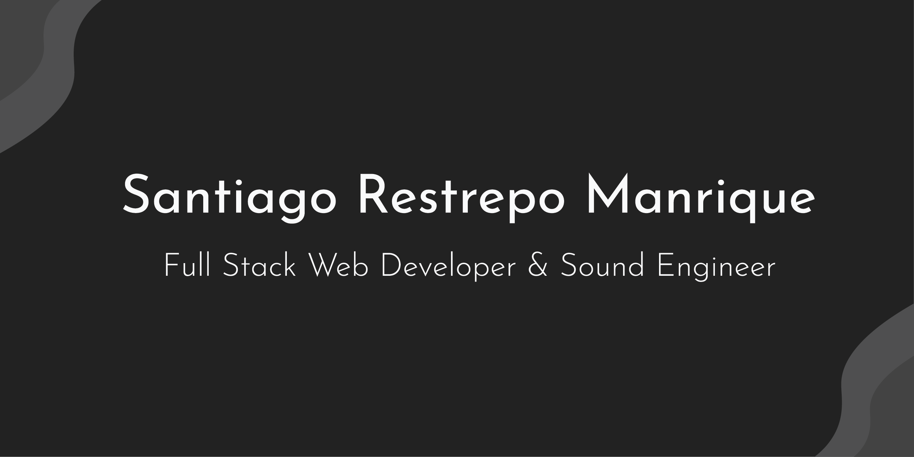

<h1 align="center">Hi 👋, I'm Santiago</h1>
<h3 align="center">A passionate fullstack web developer🚀</h3>

<h3 align="left">📄 Know about my:</h3>
• I am a Full Stack Developer with experience working in NodeJS, React, Redux, and SQL among other technologies in the industry.           

• I started my professional career as a sound engineer and through it I discovered my interest in programming, using programming languages like JUCE/C++ and MATLAB for digital signal processing.
• At the end of my undergraduate, I decided that I wanted to strengthen my skills as a programmer focusing on web development, that is how I entered the Henry bootcamp where I enhanced my theoretical and practical knowledge and got my title as Full Stack Web Developer. 
• I excel in continuous learning, and creative thinking, with strong interpersonal skills, and as a proactive being. 

<h3 align="left">📫 How to reach me:</h3>
If you want to work with me, you can send me an email to santiago.restrepo06@hotmail.com

<h3 align="left">🔧Languages and Tools:</h3>

 </a>         

<h3 align="left">🤝Connect with me:</h3>

